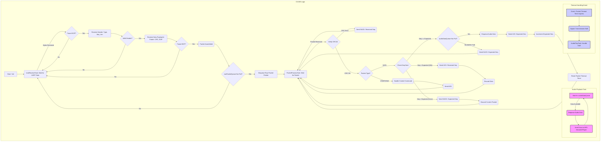
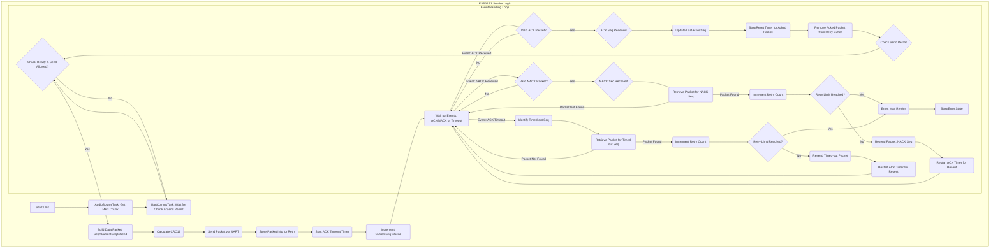

# 音频流控 UART 通信方案设计
这是一个典型的嵌入式系统间流式数据传输和处理的场景。我们可以设计一个基于**确认和流量控制**的可靠 UART 通信协议，并在 CI1303 上使用 OpenRTOS 的任务和队列来管理数据流和播放。

**核心设计思路:**

1. **分包传输:** ESP32 将 MP3 数据分割成固定大小的数据包进行传输。
2. **协议定义:** 设计一个简单的应用层协议，包含包头（类型、序号、长度）、数据和校验和。
3. **流量控制:** CI1303 通过确认（ACK）机制告知ESP32其处理能力，防止 ESP32 发送过快导致 CI1303 缓冲区溢出。
4. **错误处理:** 通过序列号检测丢包和乱序，通过校验和检测数据错误，通过超时机制处理无响应情况。
5. **RTOS任务化:** 在 CI1303 上，使用不同的 RTOS 任务分别处理 UART 接收、数据包解析/校验、音频解码/播放，任务间通过队列解耦。

---

## 1. 通信协议设计

定义一个数据包结构：

```c
// 包类型定义
#define PACKET_TYPE_START   0x01 // 开始传输指令 (可选)
#define PACKET_TYPE_DATA    0x02 // 音频数据包
#define PACKET_TYPE_END     0x03 // 结束传输指令
#define PACKET_TYPE_ACK     0x04 // 确认包 (CI1303 -> ESP32)
#define PACKET_TYPE_NACK    0x05 // 否认/重传请求包 (CI1303 -> ESP32)
#define PACKET_TYPE_STATUS  0x06 // 状态查询/回复 (可选)

// 数据包结构 (ESP32 -> CI1303)
typedef struct {
    uint8_t  sop;         // Start of Packet (e.g., 0xA5)
    uint8_t  type;        // 包类型 (PACKET_TYPE_*)
    uint16_t seqNum;      // 包序列号 (从0开始递增)
    uint16_t dataLen;     // 数据负载长度 (MP3数据)
    uint8_t* data;        // 数据负载指针 (实际传输时是连续字节)
    uint16_t crc16;       // CRC16校验和 (覆盖 type 到 data 的所有字节)
    uint8_t  eop;         // End of Packet (e.g., 0x5A)
} DataPacket_t;

// ACK/NACK 包结构 (CI1303 -> ESP32)
typedef struct {
    uint8_t  sop;         // Start of Packet (e.g., 0xA5)
    uint8_t  type;        // 包类型 (PACKET_TYPE_ACK / PACKET_TYPE_NACK)
    uint16_t ackSeqNum;   // 确认/否认的包序列号
    // uint16_t freeBuffer; // 可选: CI1303 可用缓冲区大小, 用于更精细的流控
    uint16_t crc16;       // CRC16校验和
    uint8_t  eop;         // End of Packet (e.g., 0x5A)
} AckNackPacket_t;

// --- 参数设定 ---
#define SOP_MARKER        0xA5
#define EOP_MARKER        0x5A
#define MAX_PAYLOAD_SIZE  512 // 每次传输的MP3数据最大字节数 (需根据CI1303 RAM调整)
#define HEADER_SIZE       (1 + 1 + 2 + 2) // sop, type, seqNum, dataLen
#define FOOTER_SIZE       (2 + 1)         // crc16, eop
#define MAX_PACKET_SIZE   (HEADER_SIZE + MAX_PAYLOAD_SIZE + FOOTER_SIZE)

// ACK/NACK 包大小
#define ACK_NACK_PACKET_SIZE (1 + 1 + 2 + 2 + 1)
```

* **SOP/EOP:** 用于数据包边界识别，帮助从字节流中分离数据包。
* **Type:** 区分数据包、控制指令（开始/结束）和响应（ACK/NACK）。
* **SeqNum:** 保证顺序，检测丢包。ESP32发送数据包时递增。
* **DataLen:** 指示MP3数据部分的长度。
* **Data:** MP3音频数据块。
* **CRC16:** 校验数据完整性，覆盖从`type`到`data`结束的所有字节。ESP32计算并填充，CI1303接收后重新计算并比对。

---

## 2. CI1303 (接收端) OpenRTOS 实现

### 所需RTOS资源:

* **Tasks:**
  * `UartReceiveTask`: (高优先级) 负责从UART接收字节流，寻找SOP/EOP，组装完整的数据包。
  * `PacketProcessTask`: (中优先级) 处理`UartReceiveTask`传递过来的完整数据包，进行校验、解析，并将有效音频数据放入音频缓冲区。发送ACK/NACK。
  * `AudioPlayTask`: (中/高优先级) 从音频缓冲区取数据，送给MP3解码器播放。监控缓冲区状态。
* **Queues:**
  * `rawPacketQueue`: (QueueHandle_t) `UartReceiveTask` 向 `PacketProcessTask` 传递接收到的原始数据包指针。队列大小控制了待处理包的缓冲。
  * `audioDataQueue`: (QueueHandle_t 或 RingBuffer) `PacketProcessTask` 向 `AudioPlayTask` 传递有效、按序的MP3数据块。这是核心的音频数据缓冲区，**其大小直接决定了系统的缓冲能力和抗抖动性，必须根据可用RAM仔细设计 (e.g., 4KB-8KB?)**。
* **Timers:**
  * `packetTimeoutTimer`: (Software Timer) `PacketProcessTask` 用于检测 ESP32 是否在预期时间内发送下一个数据包。

### 任务流程:

1. **`UartReceiveTask`:**
   
   * 循环读取UART硬件接收缓冲区（或使用DMA）。
   * 实现一个状态机来检测 `SOP_MARKER`。
   * 找到SOP后，开始接收数据包内容（Type, SeqNum, Len）。
   * 根据 `dataLen` 读取指定长度的数据负载和后续的 CRC、EOP。
   * 验证 `EOP_MARKER`。
   * 如果包结构基本完整（SOP/EOP匹配，长度合理），将指向接收缓冲区中完整包数据的指针发送到 `rawPacketQueue`。
   * 处理接收超时、缓冲区溢出等异常。
2. **`PacketProcessTask`:**
   
   * 循环等待 `rawPacketQueue` 中的消息（原始数据包指针）。
   * 收到指针后，获取数据包内容。
   * **校验CRC16:** 计算接收到的数据（从Type到Data）的CRC，与包中的 `crc16` 比较。
     * **CRC错误:** 丢弃数据包。向ESP32发送 `NACK`，包含当前包的 `seqNum`。
     * **CRC正确:** 继续处理。
   * **检查包类型:**
     * **`PACKET_TYPE_DATA`:**
       * **检查序列号 `seqNum`:** 维护一个 `expectedSeqNum` 变量。
         * 如果 `seqNum == expectedSeqNum`:
           * 将 `data` 部分的数据块放入 `audioDataQueue`。
           * 发送 `ACK` 给ESP32，包含 `seqNum`。
           * `expectedSeqNum++`。
           * 重置 `packetTimeoutTimer`。
         * 如果 `seqNum < expectedSeqNum`: 说明是重传的旧包，已处理过。发送 `ACK` (告知ESP32已收到)，丢弃数据。
         * 如果 `seqNum > expectedSeqNum`: 说明发生丢包。发送 `NACK`，包含 `expectedSeqNum`（请求重传丢失的包）。丢弃当前包，**不更新** `expectedSeqNum`。
       * **检查 `audioDataQueue` 状态:** 如果队列接近满（例如，超过80%），可以在发送ACK时携带一个“暂停”标志，或暂时不发送ACK（让ESP32因等待ACK超时而暂停），实现流控。更简单的方式是，只要队列不满就收，满了就丢弃并NACK（简单粗暴，可能导致播放卡顿）。推荐ACK机制本身带来的隐式流控。
     * **`PACKET_TYPE_START` / `PACKET_TYPE_END`:** 处理开始/结束逻辑（如初始化/释放播放器资源），并回复 `ACK`。
   * **处理 `packetTimeoutTimer`:** 如果在播放状态下，长时间（例如 200ms）未收到有效数据包（Timer未被重置），可以认为传输中断，通知 `AudioPlayTask` 处理（如播放静音、停止等）。
3. **`AudioPlayTask`:**
   
   * 循环等待 `audioDataQueue` 中有数据。
   * 从队列取出MP3数据块。
   * 将数据送入CI1303的MP3解码库/硬件接口进行播放。
   * 监控 `audioDataQueue` 的状态（例如，水位低于20%），如果过低可能需要主动请求数据（如果协议支持）或准备处理缓冲不足的情况（如下溢）。
   * 处理 `PacketProcessTask` 发送的传输中断信号。

### 内存管理:

* `UartReceiveTask` 需要一个或多个接收缓冲区来组装数据包。可以使用 Ping-Pong Buffer 或一个小的环形缓冲区。
* `rawPacketQueue` 传递的是指向接收缓冲区的指针，`PacketProcessTask` 处理完后需要释放或标记该缓冲区为可用。
* `audioDataQueue` 存储的是实际的MP3数据。可以使用 OpenRTOS `xQueueCreate` 创建队列，其中存储的是指向动态分配内存（`pvPortMalloc`）的数据块指针，或者直接存储固定大小的数据块（如果`MAX_PAYLOAD_SIZE`固定）。如果使用动态内存，需要 `AudioPlayTask` 在播放完后 `vPortFree`。另一种高效的方式是使用一个专门为流数据设计的**环形缓冲区 (Ring Buffer)**，避免频繁的内存分配和释放。

### 语音端数据处理流程图



---

## 3. ESP32S3 (发送端) 实现

### 所需RTOS资源 (或等效机制):

* **Tasks:**
  * `AudioSourceTask`: 获取MP3源数据（来自文件、网络流等），分割成 `MAX_PAYLOAD_SIZE` 大小的数据块。
  * `UartCommsTask`: 负责打包数据（添加协议头、CRC）、通过UART发送，并处理来自CI1303的ACK/NACK响应。管理重传逻辑和发送窗口（流控）。
* **Queues:**
  * `audioChunkQueue`: `AudioSourceTask` 向 `UartCommsTask` 传递待发送的MP3数据块。
  * `ackNackQueue`: UART接收中断/任务向 `UartCommsTask` 传递收到的ACK/NACK包。
* **State Variables:**
  * `currentSeqNum`: 当前要发送的包序号。
  * `lastAckedSeqNum`: CI1303最后确认收到的包序号。
  * `sendWindow`: (可选，用于滑动窗口流控) 允许发送但未收到ACK的最大包数量。简单实现可以认为是1（Stop-and-Wait）。
  * `retryCount`: 当前包的重传次数。
  * `unackedPackets`: (如果 `sendWindow > 1`) 存储已发送但未收到ACK的包，用于重传。
* **Timers:**
  * `ackTimeoutTimer`: 发送数据包后启动，等待CI1303的ACK/NACK。

### 任务流程 (`UartCommsTask`):

1. **发送数据:**
   
   * 从 `audioChunkQueue` 获取数据块。
   * 构建 `DataPacket_t`：填充 `SOP`, `PACKET_TYPE_DATA`, `currentSeqNum`, `dataLen`, `data`，计算并填充 `crc16`, `EOP`。
   * **流控检查:** (基于ACK) 检查是否允许发送。简单的Stop-and-Wait: `if (currentSeqNum == lastAckedSeqNum)` 才允许发送下一个。或者基于窗口: `if (currentSeqNum - lastAckedSeqNum < sendWindow)`。
   * 如果允许发送：
     * 通过UART发送数据包。
     * 存储该包信息（至少 `seqNum` 和数据本身，用于可能重传）。
     * 启动 `ackTimeoutTimer`。
     * `currentSeqNum++`。
     * `retryCount = 0`。
   * 如果不允许发送：等待ACK信号。
2. **处理ACK/NACK:**
   
   * 等待 `ackNackQueue` 消息。
   * 收到消息后，解析 `AckNackPacket_t`。
   * **校验CRC。**
   * **处理 `PACKET_TYPE_ACK`:**
     * `ackSeqNum` = 收到的确认序号。
     * `lastAckedSeqNum = ackSeqNum`。
     * 停止对应 `ackSeqNum` 包的 `ackTimeoutTimer`。
     * 从 `unackedPackets` 中移除该包。
     * **触发发送:** 现在可能满足了发送条件，检查并发送下一个数据包。
   * **处理 `PACKET_TYPE_NACK`:**
     * `nackSeqNum` = 请求重传的序号。
     * 找到 `unackedPackets` 中序号为 `nackSeqNum` 的包。
     * 立即重传该数据包（注意：使用相同的 `seqNum`）。
     * 重新启动该包的 `ackTimeoutTimer`。增加 `retryCount`。检查是否超过最大重传次数。
3. **处理 `ackTimeoutTimer`:**
   
   * 定时器超时，说明未收到对应包的ACK/NACK。
   * 认为包丢失或ACK丢失。
   * 找到超时的那个包（通常是 `lastAckedSeqNum` + 1 对应的包）。
   * 重传该数据包。
   * 重新启动 `ackTimeoutTimer`。增加 `retryCount`。
   * 如果 `retryCount` 超过最大限制（如 3-5次），报告错误，可能需要停止传输或执行更复杂的恢复逻辑。


### ESP32S3 端数据流程处理图



---

## 4. 关键考虑点

* **CI1303 RAM 限制:** `audioDataQueue` (或环形缓冲区) 的大小是关键。需要根据实际可用RAM、MP3比特率、期望的缓冲时间（如1-2秒）来计算。太小容易下溢（卡顿），太大浪费内存。`MAX_PAYLOAD_SIZE` 也受此影响。
* **波特率与处理能力:** 1M 波特率理论上约 100KB/s。需要确保 CI1303 的 `UartReceiveTask`, `PacketProcessTask`, `AudioPlayTask` 的总处理能力能跟上这个速率，特别是CRC计算和MP3解码。如果处理不过来，即使有流控，缓冲区也会持续增长（直到触发流控暂停），增加延迟。
* **CRC选择:** CRC16 (如 CRC-16-CCITT) 是一个不错的选择，平衡了校验能力和计算开销。可以使用查表法优化计算速度。
* **任务优先级:** `UartReceiveTask` 应具有较高优先级以避免UART硬件缓冲区溢出。`AudioPlayTask` 优先级也应较高以保证流畅播放。`PacketProcessTask` 可以稍低。
* **临界区保护:** 访问共享资源（如 `audioDataQueue`、状态变量）需要使用互斥锁（Mutex）、信号量（Semaphore）或关中断等机制保护，防止竞态条件。使用 RTOS 队列通常能简化这个问题。
* **启动与停止:** 需要明确的启动（如ESP32发送 `START` 包，CI1303回复 `ACK`）和停止（ESP32发送 `END` 包）流程。
* **调试:** 在协议中加入日志或状态查询机制（`PACKET_TYPE_STATUS`）会很有帮助。

这个方案提供了一个相对健壮的框架，用于在资源受限的 CI1303 和 ESP32 之间可靠地流式传输音频数据。你需要根据 CI1303 的具体可用 RAM 和性能来调整缓冲区大小、数据包大小和超时参数。
